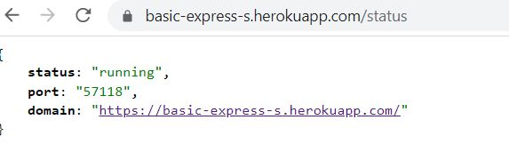
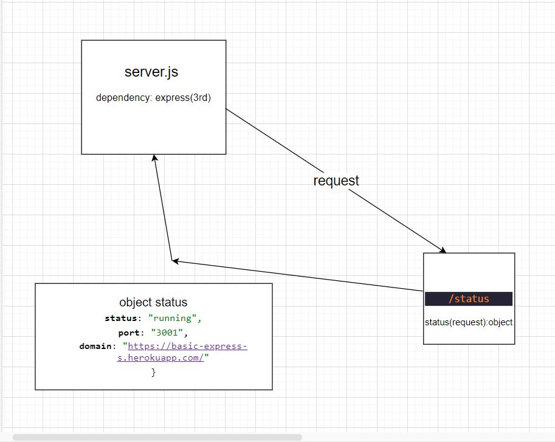

# basic-express-server
## Deployment link
 [link](https://basic-express-s.herokuapp.com/)

## Author: Thaer Braizat

* [tests report](https://github.com/thaerbraizat/basic-express-server/actions)
* [front-end](https://basic-express-s.herokuapp.com/status)

### Setup
.env requirements
* PORT -3001

### Running the app
* npm start
* Endpoint: /status
   * Returns Object

### Tests
Unit Tests: npm run test

### UML

